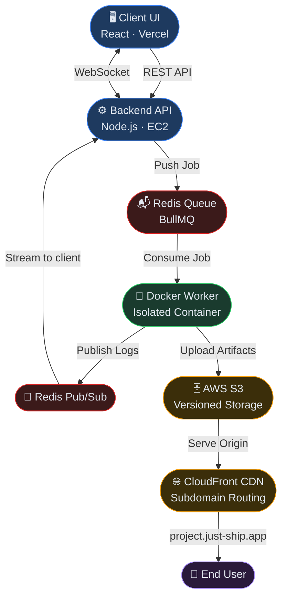

<div align="center">

<br/>

# 🚀 JustShip

**A deployment orchestration platform for frontend applications.**
Connect your GitHub repo, configure your branch, and ship — JustShip handles the rest.

<br/>


<br/>

</div>

---

## Overview

JustShip is a **production-grade CI/CD platform** that automates building, versioning, and hosting frontend applications. It mirrors how platforms like Vercel and Netlify work internally — built with an emphasis on asynchronous job processing, isolated build environments, real-time observability, and cost-optimised CDN delivery.

Every deployment is versioned, every build is isolated, and every log line reaches the browser in real time.

---

## Architecture



---

## How It Works

When a user triggers a deployment, the platform follows a strict end-to-end pipeline:

1. **Trigger** — User selects a GitHub repo and branch from the dashboard and initiates a deploy.
2. **Queue** — The backend validates the request and pushes an async job to the Redis queue via BullMQ. The API returns immediately — builds are fully non-blocking.
3. **Build** — A worker picks the job and spawns an isolated Docker container with resource limits (`--memory=200m`, `--cpus=0.3`). The container clones the repo and runs the build.
4. **Stream** — Build logs are buffered and published via Redis Pub/Sub, streamed to the browser in real time over WebSocket. Each deployment has its own isolated log room.
5. **Upload** — On success, build artifacts are uploaded to S3 in a versioned structure. The `current/` pointer is updated to the new version.
6. **Serve** — CloudFront serves the project from `project/current/` at `project.just-ship.app`. HTML is served with `no-cache`; static assets use aggressive long-term caching.

---

## Features

| Feature | Description |
|---|---|
| **GitHub OAuth** | Sign in with GitHub. Projects are linked directly to your repositories. |
| **Branch Selection** | Deploy any branch — not just `main`. Useful for staging and feature previews. |
| **Isolated Docker Builds** | Each deployment runs in its own container with CPU and memory caps. No build affects another. |
| **Real-time Log Streaming** | Live build output delivered to the browser via WebSocket. Logs persist across page refreshes. |
| **Versioned Deployments** | Every deploy is stored as an immutable snapshot (`v1`, `v2`, ...). Roll back instantly — no rebuild needed. |
| **Auto Deploy** | Enable auto-deploy on a project and every push to the configured branch triggers a deployment automatically via GitHub Webhooks. |
| **Environment Variables** | Per-project env vars managed from the dashboard. Injected securely into the build container at runtime. |
| **AI Error Summarizer** | Failed builds are automatically analysed. Returns a plain-English root cause and fix suggestions, stored alongside the deployment. |
| **Subdomain Routing** | Each project gets `project.just-ship.app`, routed at the CDN layer — no backend hop required. |

---

## Tech Stack

**Backend**
- Node.js + Express — REST API server
- BullMQ + Redis — Async job queue for deployment processing
- Redis Pub/Sub + WebSocket — Real-time log streaming pipeline
- Docker — Isolated, resource-controlled build environments

**Infrastructure**
- AWS EC2 (t3.micro) — Hosts the API server and worker process
- AWS S3 — Versioned build artifact storage
- AWS CloudFront — CDN with CloudFront Functions for subdomain routing

**Integrations**
- GitHub OAuth 2.0 — Authentication and repository access
- GitHub Webhooks — Auto-deploy trigger on push events
- LLM API — AI-powered analysis of failed build logs

---

## Storage Structure

Every deployment is stored as a versioned snapshot. Rolling back is a pointer swap — no rebuild, no downtime.

```
s3://justship-builds/
└── my-project/
    ├── v1/
    ├── v2/
    └── current/     ← always points to the active version
```

---

## CDN & Caching

Requests to `project.just-ship.app` are handled entirely at the CloudFront layer. A CloudFront Function extracts the subdomain and rewrites the request to the correct S3 path — no origin server involved in routing.

| Content | Cache Policy | Reason |
|---|---|---|
| HTML | `no-cache` | Always serve the latest deploy |
| JS / CSS / Images | `max-age=31536000` | Build tools hash filenames — stale cache is never an issue |

This avoids costly CloudFront invalidations on every deploy while ensuring users always see fresh content.

---

| Method | Endpoint | Description |
|---|---|---|
| `GET` | `/auth/github` | Initiate GitHub OAuth login |
| `GET` | `/auth/github/callback` | OAuth callback handler |
| `GET` | `/auth/me` | Returns the authenticated user's profile |
| `GET` | `/auth/logout` | Clears session and logs out |

### Deployments

| Method | Endpoint | Description |
|---|---|---|
| `POST` | `/deploy` | Trigger a new deployment |
| `POST` | `/redeploy` | Re-trigger a previous deployment |
| `GET` | `/getDeployments/:projectId` | List all deployments for a project |
| `GET` | `/logs/:jobId` | Fetch persisted build logs |
| `POST` | `/project/set-active-version` | Switch active version — instant rollback |

### Projects

| Method | Endpoint | Description |
|---|---|---|
| `GET` | `/getProjects` | List all projects for the authenticated user |
| `GET` | `/project/:projectId/env` | Get environment variables |
| `POST` | `/project/:projectId/env` | Set or update environment variables |
| `DELETE` | `/projects/:projectId` | Delete project and remove its GitHub webhook |
| `PATCH` | `/projects/:projectId/auto-deploy` | Enable or disable auto-deploy |

### GitHub Integration

| Method | Endpoint | Description |
|---|---|---|
| `GET` | `/repos` | List the user's public GitHub repositories |
| `GET` | `/github/branches` | Get branches for a selected repository |
| `POST` | `/webhook/github` | Receive and process GitHub push events |

---

## Design Decisions

**Queue-based architecture** — Builds are decoupled from the request lifecycle. BullMQ keeps the API non-blocking, provides retry handling, and safely manages concurrent deployments.

**Redis Pub/Sub over Streams** — Logs are already persisted in the database, so transport-layer replay isn't needed. Pub/Sub is simpler and lower overhead for live streaming.

**CDN caching over invalidation** — CloudFront invalidations cost money and add latency. Serving HTML with `no-cache` and hashing asset filenames delivers fresh content on every deploy — zero invalidation calls.

**Versioned S3 paths** — Overwriting files on deploy makes rollback impossible without a rebuild. Versioned paths make rollback an instant, zero-cost pointer swap.

**Log buffering** — Publishing every log line to Redis individually would flood Pub/Sub at high output rates. Buffering batches lines before publishing, keeping Redis load predictable.

---

## Limitations

- Static builds only — SSR frameworks with server-side runtime (e.g. Next.js API routes) are not supported
- Single worker — deployments are processed sequentially
- Public repositories only — private GitHub repos are excluded from listing
- Single-region CDN — no multi-region distribution at this time

---

<div align="center">

Built by [shyam](https://github.com/shyam-3045) · Inspired by Vercel & Netlify

</div>
